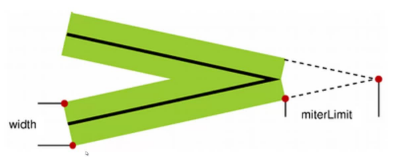

# canvas-node
canvas 学习笔记

## 2018-10-15 笔记
1. `beginPath` 与 `lineTo` 一起使用，相当于 `moveTo` 的效果，因为 `beginPath` 代表开始一段新的路径，可以使用新的状态开始绘制

2. 使用 `closePath` 会构成一个封闭的多边形

3. `canvas` 在绘制的时候，是按代码顺序进行绘制，如果碰见填充色覆盖边线，原因是 `stroke` 调用在 `fill` 之前造成的，修改调用顺序，就不会出现该问题

4. `beginPath` 和 `closePath` 没有规定必须成对出现, `closePath` 表示结束一段绘制路径

## 2018-10-18 笔记
1. `lineCap` 属性只作用于开始与结尾，不会作用于连接处

2. `lineJoin` 链接处样式修改，`default: miter`。`miterLimit: 10(default)`，如果超过该属性使用 `bevel` 来显示。

  

