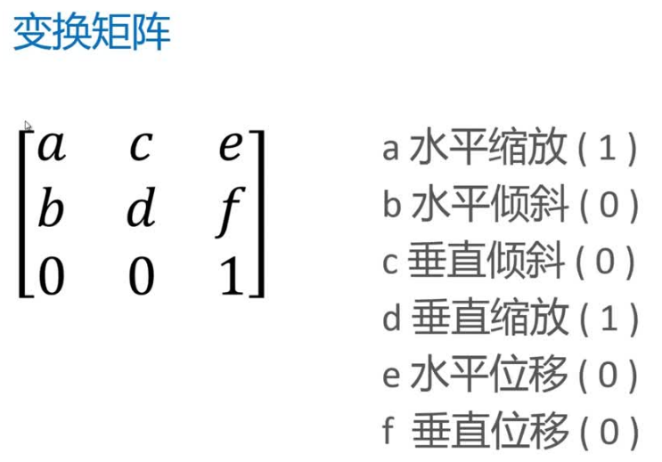

# canvas-node
canvas 学习笔记

## 2018-10-15 笔记
1. `beginPath` 与 `lineTo` 一起使用，相当于 `moveTo` 的效果，因为 `beginPath` 代表开始一段新的路径，可以使用新的状态开始绘制

2. 使用 `closePath` 会构成一个封闭的多边形

3. `canvas` 在绘制的时候，是按代码顺序进行绘制，如果碰见填充色覆盖边线，原因是 `stroke` 调用在 `fill` 之前造成的，修改调用顺序，就不会出现该问题

4. `beginPath` 和 `closePath` 没有规定必须成对出现, `closePath` 表示结束一段绘制路径

## 2018-10-18 笔记
1. `lineCap` 属性只作用于开始与结尾，不会作用于连接处

2. `lineJoin` 链接处样式修改，`default: miter`。`miterLimit: 10(default)`，如果超过该属性使用 `bevel` 来显示。

<div align=center>

  

</div>

## 2018-10-19 笔记
- 1. 从图形学角度去思考 `canvas` 画图
  - 1.1 绘制基本轮廓（路径）
  - 1.2 利用图形变换的形式来绘制

- 2. 在 `canvas` 中提供了三种图形变换: `translate`、`roate`、`scale`

**注意：**
>1. `canvas` 图形变换是叠加的。

**解决办法：**
>1. 逆转变换
```javascript
  context.translate(100, 100)
  ...
  context.translate(-100, -100)
```
>2. 使用 `save` 和 `restore` 方法处理
```javascript
context.save()
...
context.translate(100, 100)
...
context.restore()
```

- 3. `scale` 注意的问题
  - 3.1 使用 `scale` 进行缩放变换时，不仅仅是对图形大小的变换，其他数值也会变换，比如：坐标、线条宽度、大小...

**解决办法：**
>1. 放弃某些图形属性，从而避免该问题
>2. 或使用自己实现缩放功能函数

- 4. 变换矩阵 `transform` 的使用

<div align=center>

  

</div>

>1. 使用方法 `transform(a, b, c, d, e, f)`
>2. 使用 `transform` 进行缩放操作同样会出现 `scale` 同样的问题
>3. 在同一个 `save` 和 `restore` 中多次使用 `transform` 会出现效果叠加的问题

**解决办法：**
>1. 使用 `setTransform` 函数来处理

## 2018-10-23 笔记
- 1. 颜色渐变
  - 1.1 createLinearGradient(Xstar, Ystar, Xend, Yend) 创建线性渐变
  - 1.2 createRedialGradient(X0, Y0, R0, X1, Y1, R1) 创建放射性渐变
  - 1.3 addColorStop(stop, color) 渐变状态

>addColorStop 中的第一个参数是 float 类型
>当渐变不足画布，剩余部分已终点颜色填充
>当渐变超出画布，展示画布中的渐变颜色

**解决办法：** 对于渐变不足画布问题，可以使用 rect 或其他框框将其框起来展示

- 2. 填充图片等
  - 2.1 createPattern(img, repeat-style) 其中 img 为 JavsScript 中的 img 对象，reapeat-style 有四个值：no-repeat、repeat-x、repeat-y、repeat，分别代表：不填充、向 x 轴填充、向 y 轴填充、同时向两个方向填充
  - 2.2 createPattern(canvas, repeat-style) 其中 canvas 为 canvas 画布
  - 2.3 createPattern(video, repeat-style) 其中 video 为视频对象
